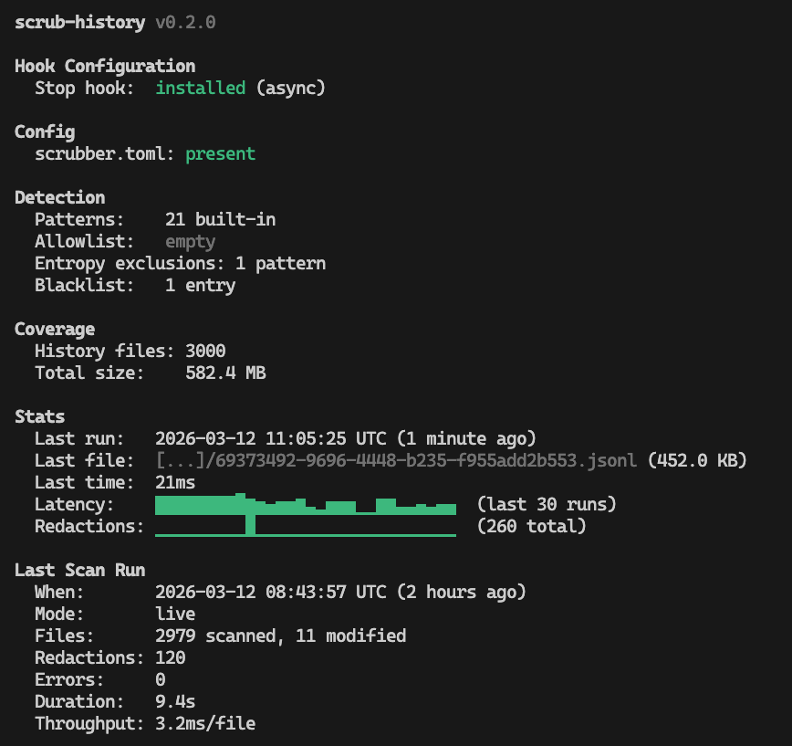

# scrub-history

A tool that automatically redacts secrets and sensitive information from [Claude Code](https://docs.anthropic.com/en/docs/claude-code) chat history files.

## Why

Claude Code stores conversation transcripts as JSONL files under `~/.claude/projects/`. These transcripts can inadvertently capture API keys, tokens, passwords, and other secrets that appear in your terminal or code. `scrub-history` finds and replaces these with `[REDACTED:pattern-name]` tags.

## Features

- **20+ built-in secret patterns** — AWS keys, GitHub/GitLab tokens, JWTs, private keys, database connection strings, Stripe/Slack/OpenAI/Anthropic keys, and more
- **Entropy-based detection** — catches high-entropy strings that look like tokens even without a known pattern
- **Two modes** — run as a Claude Code hook (real-time) or bulk-scan all history files
- **Custom patterns** — add your own via `~/.claude/scrubber-patterns.json`
- **Dry-run** — preview what would be redacted before modifying anything
- **Safe writes** — atomic temp-file writes prevent corruption

## Status dashboard

```
scrub-history status
```



## Install

```bash
cargo install --path .
```

## Usage

### Scan mode

Preview what would be redacted without modifying files:

```bash
scrub-history scan --dry-run
```

Scan all JSONL history files under `~/.claude/projects/` and redact secrets in place:

```bash
scrub-history scan
```

### Hook mode

Integrate as a Claude Code [stop hook](https://docs.anthropic.com/en/docs/claude-code/hooks) to automatically scrub transcripts after each conversation turn. Add this to your `~/.claude/settings.json`:

```json
{
  "hooks": {
    "stop": [
      {
        "command": "scrub-history hook"
      }
    ]
  }
}
```

The hook reads the transcript path from stdin and scrubs it in place.

### Options

```
-v, --verbose              Enable debug logging (-vv for trace)
-q, --quiet                Suppress all output except errors
--no-entropy               Disable entropy-based detection
--entropy-threshold <F>    Shannon entropy threshold (default: 4.5)
```

Scan-specific:

```
--dry-run                  Preview redactions without modifying files
--no-truncate              Show full secret values in dry-run output
```

## Custom patterns

Create `~/.claude/scrubber-patterns.json` with an array of pattern objects:

```json
[
  {
    "name": "internal-token",
    "regex": "itk_[A-Za-z0-9]{32}"
  }
]
```

These are merged with the built-in patterns at runtime.

## Built-in patterns

| Category | Examples |
|---|---|
| AWS | Access keys (`AKIA*`), secret keys |
| GitHub | Classic tokens (`ghp_*`), fine-grained (`github_pat_*`) |
| GitLab | Personal access tokens (`glpat-*`) |
| JWT | `eyJ*` tokens |
| Private keys | PEM-format `-----BEGIN *PRIVATE KEY-----` |
| Database | Connection strings (`postgres://`, `mongodb://`, etc.) |
| Stripe | `sk_live_*`, `pk_test_*`, `rk_*` |
| Slack | Bot/app tokens (`xoxb-*`, `xoxp-*`), webhooks |
| Anthropic | `sk-ant-*` |
| OpenAI | `sk-*` (with false-positive filtering) |
| Google | API keys (`AIza*`), OAuth secrets |
| npm | `npm_*` |
| Generic | `api_key=`, `apikey=`, password assignments |

## License

AGPL-3.0
