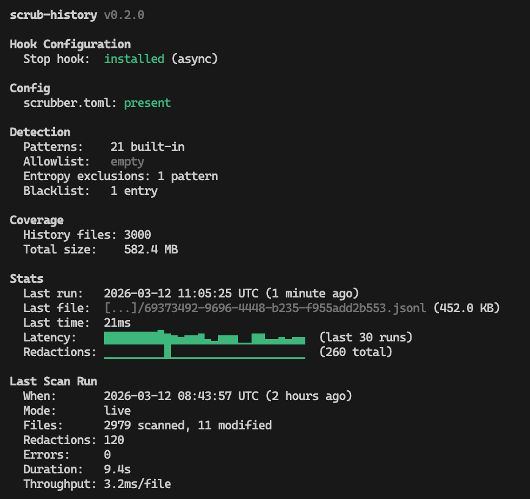

# scrub-history

A tool that automatically redacts secrets and sensitive information from [Claude Code](https://docs.anthropic.com/en/docs/claude-code) chat history files.

## Why

Claude Code stores conversation transcripts as JSONL files under `~/.claude/projects/`. These transcripts can inadvertently capture API keys, tokens, passwords, and other secrets that appear in your terminal or code. `scrub-history` finds and replaces these with `[REDACTED:pattern-name]` tags.

## Features

- **30+ built-in secret patterns** — AWS keys, GitHub/GitLab tokens, JWTs, private keys, GCP service-account keys, database connection strings, Stripe/Slack/OpenAI/Anthropic/Grafana/Vault keys, and more
- **Entropy-based detection** — catches high-entropy strings that look like tokens even without a known pattern
- **Two modes** — run as a Claude Code hook (real-time) or bulk-scan all history files
- **Custom patterns** — add your own via `~/.claude/scrubber-patterns.json`
- **Dry-run** — preview what would be redacted before modifying anything
- **Safe writes** — atomic temp-file writes prevent corruption

## Status dashboard

```
scrub-history status
```



## Install

```bash
cargo install --path .
```

## Usage

### Scan mode

Preview what would be redacted without modifying files:

```bash
scrub-history scan --dry-run
```

Scan all JSONL history files under `~/.claude/projects/` and redact secrets in place:

```bash
scrub-history scan
```

### What gets scanned

Claude Code keeps secrets in more places than the session transcripts. By default `scan` covers all of them:

| Location (`--skip` name) | Path under `~/.claude/` | Format | Default |
|---|---|---|---|
| `transcripts` | `projects/**/*.jsonl` | JSONL | redact |
| `tool-results` | `projects/*/<session>/tool-results/*` (offloaded large tool outputs) | text | redact |
| `jobs` | `jobs/**` (`tmp/parent-transcript.jsonl`, `timeline.jsonl`, scratch files) | JSONL + text | redact |
| `history` | `history.jsonl` (every typed prompt and pasted content) | JSONL | redact |
| `paste-cache` | `paste-cache/*` | text | redact |
| `file-history` | `file-history/**` (pre-edit copies of files Claude edited) | text | redact |
| `plans` | `plans/*.md` | text | redact |
| `shell-snapshots` | `shell-snapshots/*.sh` | text | redact |
| `claude-json` | `~/.claude.json` and `backups/.claude.json.backup.*` | JSON | **report only** |
| `orphan-temps` | `.tmpXXXXXX` files left by an interrupted rewrite | — | delete if >1h old |

```bash
scrub-history scan --only-transcripts          # old behaviour: projects/**/*.jsonl only
scrub-history scan --skip file-history         # keep rewind snapshots untouched
scrub-history scan --skip file-history,plans   # comma-separated or repeated
scrub-history scan --fix --skip file-history   # apply (without --fix, scan only previews)
```

How each kind is handled:

- **Text files** are streamed in line-aligned chunks through the same detector as transcripts. Files with nothing to redact are never rewritten, so they stay byte-identical (line endings, trailing newline, encoding). Binary files (images, PDFs, archives, anything with a NUL byte in the first 8 KB) and files over 50 MB are skipped, the latter with a warning. Rewrites go through a temp file in the same directory, are fsynced, keep the original file's permissions, and are abandoned if the file changed during the scan. A `.json` file is left alone if redacting it would make it invalid JSON.
- **Symlinks are never followed.** A location directory that is itself a symlink is only scanned if it resolves inside `~/.claude`.
- **`~/.claude.json` is never modified.** Its `mcpServers.*.env` (and per-project `mcpServers`) values are what your MCP servers actually use, so redacting them would break those servers. `scan` reports the key path and pattern name of each secret-looking value (never the value itself). To fix a finding, move the secret out of the file: use `"env": {"API_TOKEN": "${API_TOKEN}"}` and export it from your shell or a keychain helper, rotate the exposed value, and delete old `~/.claude/backups/.claude.json.backup.*` copies.
- **Orphaned temp files** are only touched if their name matches exactly what this tool's own atomic rewrite creates (`.tmp` plus 6 alphanumerics), they are regular files, and they are more than 1 hour old. Dry runs only list them.

**Trade-offs.** `file-history` holds the snapshots Claude Code uses to rewind edits, so redacting it means a rewind restores `[REDACTED:…]` in place of the original secret. That is usually what you want, because these are often copies of `.env`, `tfvars` or `secrets.py`. If you rely on rewind to restore such files, use `--skip file-history`. Text redaction in `tool-results`, `plans` and `paste-cache` changes what Claude sees if it re-reads those files in a resumed session. First runs over a large `file-history` take longer. After that the mtime cache skips unchanged files.

### Hook mode

Integrate as a Claude Code [stop hook](https://docs.anthropic.com/en/docs/claude-code/hooks) to automatically scrub transcripts after each conversation turn. Add this to your `~/.claude/settings.json`:

```json
{
  "hooks": {
    "stop": [
      {
        "command": "scrub-history hook"
      }
    ]
  }
}
```

The hook reads the transcript path from stdin and scrubs it in place.

### Options

```
-v, --verbose              Enable debug logging (-vv for trace)
-q, --quiet                Suppress all output except errors
--no-entropy               Disable entropy-based detection
--entropy-threshold <F>    Shannon entropy threshold (default: 4.5)
```

Scan-specific:

```
--dry-run                  Preview redactions without modifying files
--no-truncate              Show full secret values in dry-run output
```

## Custom patterns

Create `~/.claude/scrubber-patterns.json` with an array of pattern objects:

```json
[
  {
    "name": "internal-token",
    "regex": "itk_[A-Za-z0-9]{32}"
  }
]
```

These are merged with the built-in patterns at runtime.

## Built-in patterns

| Category | Examples |
|---|---|
| AWS | Access keys (`AKIA*`), secret keys |
| GitHub | Classic tokens (`ghp_*`), fine-grained (`github_pat_*`) |
| GitLab | Personal access tokens (`glpat-*`) |
| JWT | `eyJ*` tokens |
| Private keys | PEM-format `-----BEGIN *PRIVATE KEY-----` |
| Database | Connection strings (`postgres://`, `mongodb://`, etc.) |
| Stripe | `sk_live_*`, `pk_test_*`, `rk_*` |
| Slack | Bot/user tokens (`xoxb-*`, `xoxp-*`), app-level tokens (`xapp-*`), webhooks |
| Anthropic | `sk-ant-*` |
| OpenAI | `sk-*` (with false-positive filtering) |
| Google | API keys (`AIza*`), OAuth secrets, service-account JSON `private_key` values |
| npm | `npm_*` |
| Grafana | Service-account tokens (`glsa_*`), Cloud access-policy tokens (`glc_*`), legacy API keys (`eyJrIjoi*`) |
| HashiCorp Vault | Service/batch tokens (`hvs.*`, `hvb.*`) |
| Terraform Cloud | API tokens (`*.atlasv1.*`) |
| Doppler | `dp.pt.*`, `dp.st.*`, `dp.sa.*`, `dp.ct.*`, `dp.scim.*`, `dp.audit.*` |
| DigitalOcean | `dop_v1_*`, `doo_v1_*`, `dor_v1_*` |
| PyPI | Upload tokens for pypi.org and test.pypi.org (`pypi-AgE*`) |
| age | Secret keys (`AGE-SECRET-KEY-1*`) |
| Twilio / SendGrid / Heroku | `SK*`, `SG.*`, Heroku API keys |
| Generic | `api_key=`, `apikey=`, password assignments |

## License

AGPL-3.0
